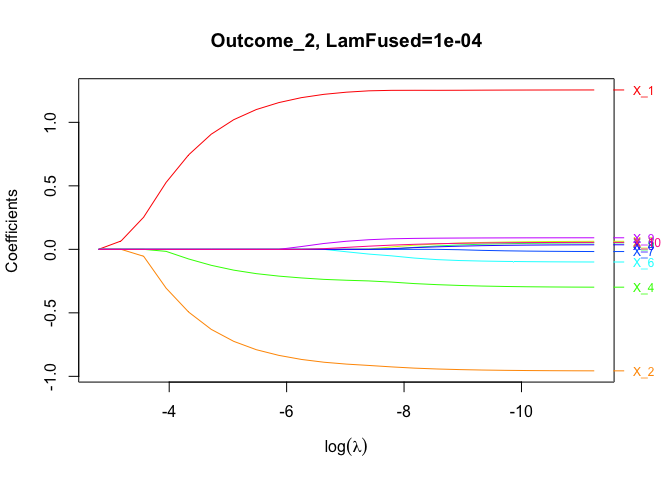
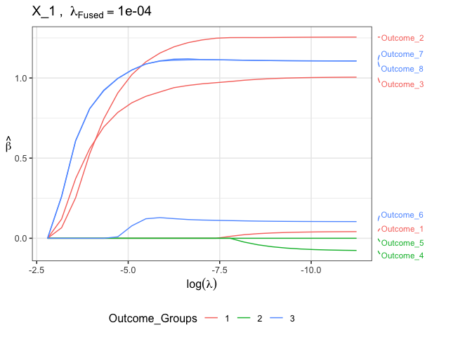

[](https://cran.r-project.org/package=groupFusedMulti)
<!-- [](https://travis-ci.org/jaredhuling/groupFusedMulti) -->

# groupFusedMulti

The `groupFusedMulti` package provides methods for hierarchical variable
selection for models with covariate effects stratified by multiple
binary factors.

## Installation and Help Files

<!-- The `groupFusedMulti` package can be installed from CRAN using: -->
<!-- ```{r, eval = FALSE} -->
<!-- install.packages("groupFusedMulti") -->
<!-- ``` -->

The development version can be installed using the **devtools** package:

``` r
devtools::install_github("jaredhuling/groupFusedMulti")
```

or by cloning and building.

Load the **groupFusedMulti** package:

``` r
library(groupFusedMulti)
```

Access help file for the main fitting function `groupFusedMulti()` by
running:

``` r
?groupFusedMulti
```

Help file for cross validation function `cv.groupFusedMulti()` can be
accessed by running:

``` r
?cv.groupFusedMulti
```

## A Quick Example

Simulate multivariate response data where the responses have a natural
grouping:

``` r
set.seed(123)

dat.sim <- gen_sparse_multivar_data(nvars = 10L,
                   noutcomes = 8L, ## 8-dim response vector
                   nobs = 100L,
                   num.nonzero.vars = 5,
                   outcome.groups = rbind(c(1,1,1,2,2,2,2,2),
                                          c(1,1,1,2,2,3,3,3)))

# design matrices
x        <- dat.sim$x
x.test   <- dat.sim$x.test

# response vectors
y        <- dat.sim$y
y.test   <- dat.sim$y.test

# true data-generating coefficients
beta     <- rbind(0,dat.sim$beta)

outcome_groups <- rbind(c(1,1,1,2,2,2,2,2),
                        c(1,1,1,2,2,3,3,3))
```

First fit a model for a range of tuning parameter values (no cross
validation perfomed here)

``` r
fit.gfm <- groupFusedMulti(x, y,
                           nlambda        = 25,
                           lambda.fused = c(0.00001, 0.0001, 0.001),
                           outcome.groups = outcome_groups,
                           adaptive.lasso = TRUE, adaptive.fused = TRUE,
                           gamma          = 0.5)
```

Plot coefficient paths for the second response/outcome across all
variables for the second fused lasso tuning parameter:

``` r
plot(fit.gfm, lam.fused.idx = 2,
     which.outcome = 2)
```

<!-- -->

Plot coefficient paths for a single variable across all outcomes for the
second fused lasso tuning parameter:

``` r
plot(fit.gfm, lam.fused.idx = 2,
     plot.type = "all_outcomes",
     which.variable = 1, ## plot for first variable
     which.outcome.group = 2) ## color according to second grouping
```

<!-- -->

Fit `groupFusedMulti` model with tuning parameter selected with 5-fold
cross validation:

``` r
cvfit.gfm <- cv.groupFusedMulti(x, y,
                                nlambda        = 50,
                                lambda.fused = c(0.000005, 0.00001, 0.000025, 0.00005, 0.0001),
                                outcome.groups = outcome_groups,
                                adaptive.lasso = TRUE, adaptive.fused = TRUE,
                                gamma          = 0.5,
                                nfolds         = 5)
```

Compare estimated with true coefficients

``` r
est.coefs <- predict(cvfit.gfm, type = "coef")
colnames(beta) <- colnames(est.coefs)
rownames(beta) <- rownames(est.coefs)

round(est.coefs, 3)
```

    ##             Outcome_1 Outcome_2 Outcome_3 Outcome_4 Outcome_5 Outcome_6
    ## (Intercept)     0.047    -0.105    -0.087    -0.057    -0.057    -0.064
    ## X_1             0.000     1.146     0.908     0.000     0.000     0.131
    ## X_2            -0.440    -0.827     0.000     0.000     0.562     0.343
    ## X_3             0.000     0.000     0.000     0.000     0.000     0.016
    ## X_4            -0.312    -0.207    -0.381     0.000     0.000    -0.062
    ## X_5            -0.247     0.000    -0.327     0.000     0.000    -0.493
    ## X_6             0.000     0.000     0.000    -0.010    -0.001    -0.002
    ## X_7             0.000     0.000     0.000     0.000     0.014     0.052
    ## X_8             0.000     0.000     0.000     0.000     0.000     0.000
    ## X_9             0.000     0.000     0.000     0.000     0.000     0.000
    ## X_10            0.000     0.000     0.000     0.000     0.000     0.000
    ##             Outcome_7 Outcome_8
    ## (Intercept)    -0.102    -0.064
    ## X_1             1.103     1.103
    ## X_2             0.343     0.320
    ## X_3            -0.205     0.016
    ## X_4            -0.062    -0.022
    ## X_5            -0.148    -0.493
    ## X_6             0.000     0.000
    ## X_7             0.011     0.000
    ## X_8             0.000     0.000
    ## X_9             0.000     0.000
    ## X_10            0.000     0.000

``` r
beta
```

    ##             Outcome_1 Outcome_2 Outcome_3 Outcome_4 Outcome_5 Outcome_6
    ## (Intercept)     0.000     0.000     0.000     0.000       0.0     0.000
    ## X_1             0.000     1.000     1.000     0.000       0.0     0.000
    ## X_2            -0.500    -1.000    -0.125     0.000       0.5     0.500
    ## X_3            -0.125    -0.125    -0.125     0.000       0.0     0.000
    ## X_4            -0.125    -0.125    -0.125    -0.125       0.0    -0.125
    ## X_5            -0.500     0.000    -0.500     0.000       0.0    -0.500
    ## X_6             0.000     0.000     0.000     0.000       0.0     0.000
    ## X_7             0.000     0.000     0.000     0.000       0.0     0.000
    ## X_8             0.000     0.000     0.000     0.000       0.0     0.000
    ## X_9             0.000     0.000     0.000     0.000       0.0     0.000
    ## X_10            0.000     0.000     0.000     0.000       0.0     0.000
    ##             Outcome_7 Outcome_8
    ## (Intercept)     0.000     0.000
    ## X_1             1.000     1.000
    ## X_2             0.500     0.500
    ## X_3            -0.500     0.125
    ## X_4            -0.125    -0.125
    ## X_5             0.000    -0.500
    ## X_6             0.000     0.000
    ## X_7             0.000     0.000
    ## X_8             0.000     0.000
    ## X_9             0.000     0.000
    ## X_10            0.000     0.000

Predict response for test data:

``` r
preds.gfm <- predict(cvfit.gfm, x.test, type = 'response')
str(preds.gfm)
```

    ##  num [1:100, 1:8] -0.993 -0.147 -0.171 0.113 0.848 ...

Evaluate mean squared error for each outcome:

``` r
sqrt(colMeans((y.test - preds.gfm) ^ 2))
```

    ## [1] 0.9994061 1.1574990 1.0671242 1.0068098 0.9782761 1.0634526 1.1578628
    ## [8] 1.0385384

Average MSE across the 8 outcomes:

``` r
mean(sqrt(colMeans((y.test - preds.gfm) ^ 2)))
```

    ## [1] 1.058621
